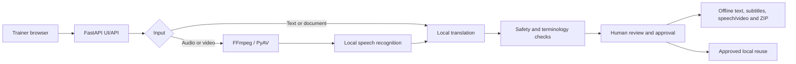

# VaaniSetu

VaaniSetu is a local, open-source translation workflow for BAIF learning material. Authorised trainers can translate English, Hindi and Marathi text, recordings, documents, audio and video; review the result; and export an integrity-protected package that works offline in the field.

Normal jobs run on the configured worker. They do not silently download models, call paid APIs or send BAIF content to hosted translation services.

## Current status

Product engineering and internal submission work are complete. The release candidate has 69 automated tests, including 20 adversarial regressions, plus real-model browser/video, recovery, package-integrity and full-boundary stress evidence.

Three external acceptance gates remain before an unrestricted production claim:

1. accept and cache the intended MIT-licensed IndicTrans2 checkpoints;
2. obtain Hindi and Marathi reviewer approval; and
3. prove installation and UAT on BAIF's Windows 11 CPU baseline.

See the [implementation roadmap](IMPLEMENTATION_ROADMAP.md) for the completion record and the three external gates.

## What it delivers

- Browser recording, text entry and controlled multi-file upload
- TXT, Markdown, PDF/scanned PDF, DOCX, PPTX, XLSX, CSV and TSV extraction
- Audio/video transcription and six English/Hindi/Marathi translation directions
- Translated text, SRT/VTT subtitles, optional speech, captioned video and translated-audio video
- Human correction, versioned approval and exact approved translation-memory reuse
- Agriculture glossary insights, invariant/script checks and visible model/review provenance
- Searchable local library, sequential CPU-safe batches and privacy-safe impact reporting
- Offline ZIP with direct links, media playback and a checksum manifest
- Local authentication, durable queue, restart recovery, backup/restore and support tooling

BAIF input limits and supported formats are listed in [DELIVERY_COMPATIBILITY.md](DELIVERY_COMPATIBILITY.md).

## Architecture



One managed CPU worker holds the models and artifacts; trainers use the browser on that machine or the BAIF LAN. Translation occurs at the office, while downloaded outputs work without the server in the field. The deployment decision is explained in [BAIF_ARCHITECTURE_NOTE.md](BAIF_ARCHITECTURE_NOTE.md).

## Install and run

Python 3.10 or 3.11 is required.

### Windows 11 BAIF worker

From PowerShell in the repository root:

```powershell
.\scripts\setup_baif_worker.ps1
.\scripts\start_baif_worker.ps1
```

The setup wrapper installs the Python stack and, when available, FFmpeg/Tesseract. Model repositories that require access approval must be accepted by an authorised team account first. Do not commit or share the account token.

### Manual setup

```bash
python -m venv .venv
source .venv/bin/activate          # Windows: .\.venv\Scripts\Activate.ps1
python -m pip install --upgrade pip
python scripts/one_click_setup.py --profile balanced
python -m uvicorn app:app --host 127.0.0.1 --port 8501
```

Open `http://127.0.0.1:8501`, create the first administrator, and approve trainer accounts. Use `--host 0.0.0.0` only on an approved BAIF LAN/reverse-proxy deployment; never expose the worker directly to the public internet.

Before production use:

```bash
python scripts/operations.py preflight
python scripts/operations.py model-inventory
```

Preflight must be green with runtime model downloads and hosted translation disabled. The confirmed baseline is Windows 11, 16 GB RAM, six or more CPU cores and one model worker. Systems below 16 GB are unsupported; the quality profile requires measured headroom.

## Model and licence policy

| Capability | Intended judged path | Engineering fallback |
| --- | --- | --- |
| Speech recognition | IndicConformer or faster-whisper, chosen with reviewed WER evidence | Smaller faster-whisper CPU profile |
| Translation | AI4Bharat IndicTrans2 | NLLB-200 CTranslate2 INT8 |
| Speech | Indic Parler TTS or Piper | eSpeak NG |
| Documents/media | Local Tesseract/PDFium/pypdf and FFmpeg/PyAV | Text/subtitle output remains available when optional speech is absent |

NLLB is licensed CC-BY-NC-4.0 and is retained for engineering evaluation and resilience. It must not be presented as the final unrestricted production model unless BAIF explicitly accepts that licence. Hosted translation is disabled by default and is not acceptable evidence for judged quality. See [OPEN_SOURCE_COMPLIANCE.md](OPEN_SOURCE_COMPLIANCE.md).

Model setup is automated:

```bash
python scripts/setup_models.py --profile quality --with-translation --with-tts --with-indic-asr
python scripts/convert_nllb_ct2.py
```

## Validation

Run before every release candidate:

```bash
python -m py_compile $(git ls-files '*.py')
python -m unittest discover -s tests -v
python scripts/release_check.py
python scripts/evaluate_quality.py
```

Operational evidence:

```bash
python scripts/operations.py preflight
python scripts/stress_test.py --profile full
python scripts/failure_drill.py
python scripts/verify_package.py outputs/JOB_ID/vaanisetu_outputs.zip
python scripts/release_evidence.py
python scripts/build_submission_bundle.py
```

The benchmark is an engineering gate, not bilingual approval. Current results and limitations are recorded in [TEST_EVIDENCE.md](TEST_EVIDENCE.md).

## Operations

```bash
python scripts/operations.py cleanup --days 7 --dry-run
python scripts/operations.py backup backups/vaanisetu-backup.zip
python scripts/operations.py restore backups/vaanisetu-backup.zip --force
python scripts/operations.py support-bundle outputs/support.zip
```

Backups contain operational content and belong only in BAIF-approved encrypted storage. Support bundles are privacy-filtered but must still be inspected before sharing.

## Documentation

| Need | Document |
| --- | --- |
| Three-minute team snapshot | [NOW.md](NOW.md) |
| Current completion and next work | [IMPLEMENTATION_ROADMAP.md](IMPLEMENTATION_ROADMAP.md) |
| Organiser requirement mapping | [HACKATHON_REQUIREMENTS_AUDIT.md](HACKATHON_REQUIREMENTS_AUDIT.md) |
| Architecture and deployment rationale | [BAIF_ARCHITECTURE_NOTE.md](BAIF_ARCHITECTURE_NOTE.md) |
| Formats, limits and target hardware | [DELIVERY_COMPATIBILITY.md](DELIVERY_COMPATIBILITY.md) |
| Trainer operation | [USER_GUIDE.md](USER_GUIDE.md) |
| Administrator operation | [ADMIN_GUIDE.md](ADMIN_GUIDE.md) |
| Handover index | [HANDOVER.md](HANDOVER.md) |
| Release acceptance | [RELEASE_CHECKLIST.md](RELEASE_CHECKLIST.md) and [UAT.md](UAT.md) |
| Privacy, licences and support | [PRIVACY.md](PRIVACY.md), [OPEN_SOURCE_COMPLIANCE.md](OPEN_SOURCE_COMPLIANCE.md), [SUPPORT_MODEL.md](SUPPORT_MODEL.md) |
| Verification evidence | [TEST_EVIDENCE.md](TEST_EVIDENCE.md) |
| Final deck and judge demo | [submission/README.md](submission/README.md) and [SUBMISSION_RUNBOOK.md](SUBMISSION_RUNBOOK.md) |

## Honest boundaries

- Machine output remains a draft until an appropriate reviewer approves it.
- Accuracy varies with dialect, noise, OCR quality and model availability.
- Health, pesticide, financial, safety or legally consequential instructions require human review.
- Translation is an office workflow; VaaniSetu is not a live field translator.
- Offline means exported field packages work without the worker—it does not mean every installation step is internet-free.
- Exact Office layout reconstruction is outside scope; document exports prioritise reviewable translated content.
