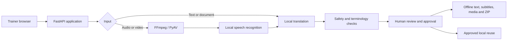

# VaaniSetu

VaaniSetu is a local-first translation workspace built for BAIF learning content. It helps authorised teams convert English, Hindi and Marathi text, documents, recordings, audio and video into reviewed, reusable and offline-ready field material—without sending normal jobs to paid or hosted translation APIs.

The product is designed for a managed Windows 11 CPU worker at the BAIF office. Trainers use a focused browser workflow; field recipients use integrity-protected output packages without requiring the application or an internet connection.

## Product status

VaaniSetu is a verified release candidate ready for controlled Windows acceptance testing.

- 78 automated tests, including 20 adversarial security and recovery regressions
- All eight BAIF-supplied videos validated in place for format, size, duration, resolution and streams
- The real 5:43 BAIF sample completed the final full local pipeline in 3:47 on an 8 GB engineering Mac; transcript/translation content remains private
- Real browser, public-video, offline-package, backup/restore, failure-drill and boundary-stress evidence
- Privacy-safe release evidence, source manifest, SBOM, model inventory and submission builder

Production approval remains intentionally gated by the target Windows run, accepted local IndicTrans2 inventory and Hindi/Marathi reviewer sign-off. See [Acceptance](ACCEPTANCE.md) for the exact go/no-go decision.

## What the product delivers

### Translate real training material

- Browser microphone recording, text entry and sequential multi-file upload
- TXT, Markdown, PDF, scanned PDF, DOCX, PPTX, XLSX, CSV and TSV extraction
- Audio/video transcription with explicit spoken-language selection
- Six translation directions across English, Hindi and Marathi
- Enforced media limits aligned to BAIF's CPU and storage constraints

### Review before distribution

- Visible source text, model provenance, processing time and actionable warnings
- Number, unit, URL, email, script and unchanged-output safeguards
- Agriculture terminology prompts and reviewer-visible glossary findings
- Editable corrections, versioned approval and exact approved-translation reuse
- Machine output clearly treated as a draft until human approval

### Take outputs offline

- Translated text and reviewable document/table exports
- SRT and VTT subtitles
- Optional translated speech, captioned video and translated-audio video
- Searchable local job library and controlled reruns
- Offline ZIP with `CONTENTS.html`, direct media playback and checksum verification

### Operate it responsibly

- Local authentication, first-admin bootstrap and administrator approval
- Durable single-worker queue, cancellation and restart recovery
- Health, preflight, metrics and privacy-safe aggregate impact reporting
- Model inventory, backup/restore, retention cleanup and redacted support bundles
- Runtime model downloads disabled; no hosted translation route in the release
- Visible segment-level video transcription progress, ETA and an elapsed-time safety guard

## Architecture



One managed worker keeps model versions, memory use and operational support predictable. Translation happens at the office; downloaded packages work independently in the field. The rationale and component boundaries are documented in [Architecture](ARCHITECTURE.md).

## Where VaaniSetu fits alongside Bhashini

[Bhashini](https://dibd-bhashini.gitbook.io/bhashini-apis) provides a broad Indian-language model and API ecosystem across capabilities such as speech recognition, translation and speech generation. VaaniSetu does not claim superior model accuracy without a controlled benchmark. It is a BAIF-specific, locally operated content workflow: governed inputs, visible provenance, agricultural review prompts, human approval, exact approved reuse, durable job history, failure recovery and integrity-checked offline field packages.

Bhashini is a strong fit when national language breadth or hosted API integration is the priority. VaaniSetu is designed for controlled office-to-field operations where review, privacy, reuse and offline distribution matter alongside translation. Its adapter boundary can support a future BAIF-approved model; no Bhashini service is called by the current release.

## Start on Windows 11

Requirements: Windows 11, Python 3.10/3.11, [Microsoft C++ Build Tools](https://learn.microsoft.com/en-us/cpp/overview/acquire-msvc?view=msvc-170) with **Desktop development with C++**, FFmpeg, Tesseract, eSpeak NG, at least 16 GB RAM, six or more CPU cores and 20 GB free disk.

```powershell
.\scripts\setup_baif_worker.ps1
.\scripts\windows_acceptance.ps1 -VideosPath "C:\BAIF-Test-Data\Videos"
.\scripts\start_baif_worker.ps1
```

Open `http://127.0.0.1:8501`. Follow [Setup](SETUP.md) from a clean machine; it covers prerequisites, controlled model access, automated evidence, accounts, real BAIF media, offline verification, recovery and the final decision. Local startup is private by default. LAN mode requires an explicit option and BAIF-approved network controls.

## Developer setup

```bash
python -m venv .venv
source .venv/bin/activate
python -m pip install --upgrade pip
python scripts/one_click_setup.py --profile balanced
python -m uvicorn app:app --host 127.0.0.1 --port 8501
```

Model repositories requiring approval must be accepted through an authorised account during controlled setup. Tokens, model weights, BAIF media and runtime content must never be committed.

## Release verification

```bash
python -m py_compile $(git ls-files '*.py')
node --check frontend/app.js
python -m unittest discover -s tests -v
python -m pip check
python scripts/release_check.py
python scripts/demo_smoke_test.py --full
python scripts/failure_drill.py
python scripts/release_evidence.py
python scripts/build_submission_bundle.py
```

Quality scores are engineering evidence, not linguistic approval. NLLB remains a non-commercial engineering fallback; the intended production translation route is locally cached IndicTrans2. See [Testing](TESTING.md) and [Licensing](LICENSING.md).

## Documentation

| Audience or decision | Document |
| --- | --- |
| Clean Windows installation and formal test | [Setup](SETUP.md) |
| Trainer workflow | [Usage](USAGE.md) |
| Administration, recovery and support | [Operations](OPERATIONS.md) |
| Test personas and release go/no-go | [Acceptance](ACCEPTANCE.md) |
| Engineering verification and known limits | [Testing](TESTING.md) |
| Architecture and deployment rationale | [Architecture](ARCHITECTURE.md) |
| Formats, limits and target hardware | [Compatibility](COMPATIBILITY.md) |
| Privacy and data handling | [Privacy](PRIVACY.md) |
| Model and dependency licences | [Licensing](LICENSING.md) |
| BAIF ownership and knowledge transfer | [Handover](HANDOVER.md) |
| Requirement traceability | [Requirements](REQUIREMENTS.md) |
| Final compliance, risk and judge-readiness audit | [Audit](AUDIT.md) |
| Judge walkthrough and fallback | [Demo](DEMO.md) |

The browser-served onboarding guide is available at `/onboarding` after startup. The final five-slide deck is in [submission](submission/README.md).

## Responsible-use boundaries

- Consequential health, pesticide, financial, safety or legal instructions require qualified human review.
- Accuracy varies with dialect, noise, OCR quality and the installed model set.
- Offline means exported packages work without the worker; controlled installation still requires dependencies and model assets.
- Exact Office layout reconstruction is outside scope; exports prioritise reviewable translated content.
- Do not expose the worker directly to the public internet or place confidential BAIF material in public evidence.
