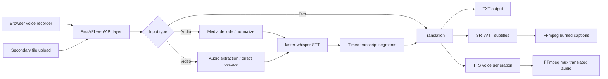

# VaaniSetu BAIF Translator

Open-source multilingual translation for learning modules, text, audio, and video. The app is built for BAIF teams to turn Marathi, Hindi, and English content into translated text, subtitles, document exports, and optional speech/video outputs.

No paid APIs. No OpenAI, Google Cloud, Azure, AWS Transcribe, or ElevenLabs. The app uses open-source software and locally cached model assets whose licenses are documented separately. Internet is used during controlled setup; normal translation jobs do not silently download models or send content to hosted translation services.

## Features

- Voice-note recording in the browser as the primary input
- In-app playback for recorded source audio and translated voice output
- Secondary upload path for existing text, document, audio, and video files
- Selectable-text and scanned PDF, DOCX, PPTX, XLSX, CSV, and TSV translation with reviewable TXT/Markdown/table exports
- Audio/video transcription with faster-whisper
- Transcript translation between Marathi, Hindi, and English
- SRT and VTT subtitle export
- Translated voice output with Indic Parler, Piper, or compact eSpeak NG fallback
- Optional burned-in captions and translated audio video export with FFmpeg
- Modern FastAPI-served web UI with progress, previews, playback, and downloads
- Runtime readiness API for media, ASR, translation, OCR, and speech capabilities
- Job report JSON with backend, warnings, and generated artifact metadata
- One-click ZIP export containing all generated artifacts for offline field playback or reuse

## Production Model Stack

VaaniSetu is designed as a local/on-prem model-worker product with a browser UI. BAIF installs the open-source model stack once on an office workstation, LAN server, or provider-managed machine. Users access the same machine through the web UI/API, while the heavy models stay local to that worker. This gives better reproducibility and quality than depending on public translation APIs, without forcing every user laptop or phone to install Python, FFmpeg, and model weights.

Recommended provider stack:

| Task | Production choice | Why |
| --- | --- | --- |
| Speech-to-text | AI4Bharat IndicConformer or `faster-whisper-large-v3` | Benchmark both on BAIF field audio; use the lower-WER backend per language. |
| Low-latency STT | `faster-whisper-small` or `faster-whisper-base` | Faster CPU fallback for low-resource machines. |
| Translation | AI4Bharat IndicTrans2; NLLB-200 CTranslate2 INT8 evaluation fallback | Indian-language judged path plus a fast local fallback whose non-commercial model license must be reviewed. |
| Text-to-speech | AI4Bharat Indic Parler TTS, Piper, or eSpeak NG | Natural-voice quality tier plus a compact open-source WAV fallback for English, Hindi, and Marathi. |
| Media processing | FFmpeg | Reliable open-source extraction, caption burn-in, and muxing. |
| Documents | Python ZIP/XML parsers, pypdf, PDFium, and Tesseract | Handles learning module files and automatic scanned-PDF OCR without paid office automation. |

The judged production path must use locally hosted open-source models on the BAIF worker. Any convenience fallback must be explicitly reported and must not be used as evidence of final model quality. See [OPEN_SOURCE_COMPLIANCE.md](OPEN_SOURCE_COMPLIANCE.md).

BAIF delivery limits and handover expectations are documented in [DELIVERY_COMPATIBILITY.md](DELIVERY_COMPATIBILITY.md).
The install-versus-web/API delivery decision is explained in [BAIF_ARCHITECTURE_NOTE.md](BAIF_ARCHITECTURE_NOTE.md).

Model profile is controlled by `BAIF_MODEL_PROFILE`:

```bash
export BAIF_MODEL_PROFILE=fast      # low-resource CPU/serverless profile
export BAIF_MODEL_PROFILE=balanced  # default local/provider profile
export BAIF_MODEL_PROFILE=quality   # provider production backend
```

The Docker deployment defaults to `quality`. Local development defaults to `balanced` so a laptop does not unexpectedly download the largest model.

## Architecture



## Project Structure

```text
app.py
requirements.txt
README.md
frontend/
config/
core/
models/
outputs/
samples/
temp/
```

## Installation

### One-command BAIF worker setup

Use this on the BAIF office worker or approved provider machine:

```bash
python scripts/one_click_setup.py --profile balanced
```

Windows shortcut:

```powershell
.\scripts\setup_baif_worker.ps1
```

macOS/Linux shortcut:

```bash
./scripts/setup_baif_worker.sh
```

Start the app after setup. The Windows launcher disables runtime model downloads so a user job never changes the installation:

```bash
python -m uvicorn app:app --host 0.0.0.0 --port 8501
```

```powershell
.\scripts\start_baif_worker.ps1
```

The preferred IndicTrans2 and Indic Parler repositories require one-time acceptance of their Hugging Face access conditions. Setup installs NLLB first and converts it to an INT8 CTranslate2 runtime, so the worker remains usable and responsive if that optional access is not ready. NLLB is CC-BY-NC-4.0 and is retained as an evaluation/resilience fallback, not the final judged open-source claim. After accepting the AI4Bharat terms, set `HF_TOKEN` and rerun model setup to enable the intended IndicTrans2 path.

### Linux

```bash
python3 -m venv .venv
source .venv/bin/activate
python -m pip install --upgrade pip
pip install -r requirements.txt
sudo apt-get update
sudo apt-get install -y ffmpeg
uvicorn app:app --host 0.0.0.0 --port 8501
```

Install the full local/on-prem model stack when preparing a production media worker:

```bash
pip install -r requirements-full.txt
```

Install the judged quality stack, including Indic Parler TTS and evaluation tools:

```bash
pip install -r requirements-quality.txt
```

### Windows

```powershell
py -m venv .venv
.\.venv\Scripts\Activate.ps1
python -m pip install --upgrade pip
pip install -r requirements.txt
uvicorn app:app --host 0.0.0.0 --port 8501
```

Install FFmpeg for Windows from the official FFmpeg builds and add the `bin` folder to `PATH`. Confirm with:

```bash
ffmpeg -version
ffprobe -version
```

## Model Setup

The app can download/cache open-source models when internet is available. For repeatable production use, pre-download them:

```bash
python scripts/setup_models.py --profile quality --with-translation --with-tts --with-indic-asr
```

You can download only one model family:

```bash
python scripts/setup_models.py --profile balanced
python scripts/setup_models.py --only whisper-quality
python scripts/setup_models.py --only indictrans-en-indic
python scripts/convert_nllb_ct2.py
```

### faster-whisper

Download a faster-whisper model once while online. Example:

```bash
python - <<'PY'
from huggingface_hub import snapshot_download
snapshot_download(
    repo_id="Systran/faster-whisper-large-v3",
    local_dir="models/whisper/faster-whisper-large-v3",
    local_dir_use_symlinks=False,
)
PY
```

Production quality path:

```text
models/whisper/faster-whisper-large-v3
```

### IndicTrans2

Download the required AI4Bharat IndicTrans2 model directories once:

```bash
python - <<'PY'
from huggingface_hub import snapshot_download
models = {
    "ai4bharat/indictrans2-en-indic-1B": "models/indictrans2/indictrans2-en-indic-1B",
    "ai4bharat/indictrans2-indic-en-1B": "models/indictrans2/indictrans2-indic-en-1B",
    "ai4bharat/indictrans2-indic-indic-1B": "models/indictrans2/indictrans2-indic-indic-1B",
}
for repo, path in models.items():
    snapshot_download(repo_id=repo, local_dir=path, local_dir_use_symlinks=False)
PY
```

Set these env vars if you store models elsewhere:

```bash
export BAIF_INDICTRANS_EN_INDIC_MODEL=/path/to/en-indic
export BAIF_INDICTRANS_INDIC_EN_MODEL=/path/to/indic-en
export BAIF_INDICTRANS_INDIC_INDIC_MODEL=/path/to/indic-indic
```

For offline installation validation without translation models, enable the deterministic phrasebook fallback:

```bash
export BAIF_ALLOW_PREVIEW_TRANSLATOR=1
```

### Piper TTS

Install Piper and download free voice models into:

```text
models/piper/
```

The app searches for `.onnx` voice files matching the target language hint (`en`, `hi`, or `mr`). If no voice is present, the text/subtitle pipeline still succeeds and shows a warning for voice output.

## Usage

```bash
uvicorn app:app --host 0.0.0.0 --port 8501
```

Open `http://localhost:8501`.

1. Select source and target language.
2. Press **Start recording** and speak like a voice note.
3. Stop, listen to the captured note, then press **Translate to voice**.
4. Play the translated voice output in the app.
5. Download MP3, WAV, TXT, SRT, VTT, or the all-outputs ZIP when needed.

Existing files are still supported through the secondary upload control below the recorder. For documents, upload selectable-text or scanned PDF, DOCX, PPTX, XLSX, CSV, or TSV. Scanned PDFs are processed with local Tesseract OCR when that capability is ready; the UI reports a clear fallback when it is not.

## Mobile-Friendly API Mode

For mobile users, do not run models on the phone. Deploy the API on a server and let phones call it. BAIF users should normally use the browser UI or API client while the model stack runs on BAIF-premises/provider infrastructure.

```bash
uvicorn api:app --host 0.0.0.0 --port 8000
```

Endpoints:

```text
GET  /health
GET  /languages
GET  /limits
POST /translate/text
POST /translate/file
GET  /jobs/{job_id}/artifacts/{artifact_key}
```

This keeps phones lightweight: the mobile app uploads text/document/audio/video, the server runs open-source extraction/STT/translation/TTS models, and the response returns translated text plus download links for TXT, Markdown, table, SRT, VTT, audio, video, and ZIP artifacts.

The translation layer is local/open-source first. Keep heavy model dependencies on the backend worker and expose only the API/UI to users. `BAIF_ENABLE_HOSTED_TRANSLATION=1` exists only as an explicitly marked emergency demo fallback; it should stay disabled for judged quality runs.

## Provider-Managed Deployment

End users should never install Python packages, FFmpeg, or model weights. Those are provider/backend responsibilities.

Run the full stack with Docker:

```bash
docker compose up --build
```

Then expose:

```text
Web app: http://server:8501
API:     http://server:8000
```

The Docker image installs system dependencies and Python libraries once. Model weights are cached in the mounted `models/` volume so the first server run prepares them and later runs reuse them.

Generated artifacts are stored under `outputs/<job_id>/`, and a reuse ledger is appended to `outputs/manifest.jsonl` for BAIF reference.

For production, prepare the quality model cache once:

```bash
docker compose run --rm web python scripts/setup_models.py --profile quality --with-translation
docker compose up --build
```

## Vercel Deployment

Vercel serves the modern web UI and FastAPI endpoints using the lightweight serverless profile:

```bash
vercel --prod
```

The Vercel profile uses `/tmp/vaanisetu` for runtime files and the `fast` model profile. Full offline/on-prem media processing with large local model weights is best deployed with Docker or a GPU-backed VM because Vercel Functions have bundle and runtime limits.

## Validation

Run the local checks before a release:

```bash
python -m py_compile $(git ls-files '*.py')
python -m unittest discover -s tests
```

The tests do not require large ML models; they verify import safety, text processing, subtitle formatting, upload validation, and the text-output pipeline.

Run the reviewed translation benchmark before comparing model or configuration changes:

```bash
python scripts/evaluate_quality.py
```

The generated `outputs/quality_report.json` records per-sample predictions, backend names, and chrF++ scores. Expand the benchmark with BAIF-reviewed field language before final judging.

## Assumptions and Limitations

- Setup can use BAIF-premises internet to download/cache approved model weights. Generated outputs are downloadable and usable offline in the field.
- Translation quality depends on the locally installed IndicTrans2 checkpoints. NLLB is a CC-BY-NC-4.0 evaluation/resilience fallback pending BAIF license confirmation.
- faster-whisper is robust but transcription accuracy depends on audio quality, noise, and dialect.
- Music-only files or songs with vocals mixed under instruments may not produce a useful speech transcript.
- Piper voice availability for Indian regional languages can vary by installed model. Indic Parler TTS is the recommended production TTS direction.
- Burned-in subtitle styling uses FFmpeg defaults.
- Large videos are supported through streaming FFmpeg processing, but local CPU, memory, disk space, and processing time still matter.
- BAIF delivery profile enforces 30-minute audio, 15-minute video, 1080p max video, and differentiated size caps by file type.

## Operating Notes

For a reliable first run, start with a short clean voice recording, then an uploaded speech clip, then a short MP4. Keep files under a few minutes on CPU-only machines unless the deployment has enough CPU/GPU capacity.

The app creates missing `temp/`, `outputs/`, `models/`, and `samples/` folders automatically.
