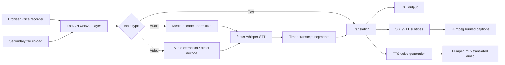

# VaaniSetu BAIF Translator

Open-source multilingual translation for text, audio, and video. The app is built for BAIF field teams to turn Marathi, Hindi, and English content into translated text, subtitles, and optional speech/video outputs.

No paid APIs. No OpenAI, Google Cloud, Azure, AWS Transcribe, or ElevenLabs. The app uses free/open-source tools and models. Internet may be used to download/cache open-source model weights, and the same models can later run from local cache.

## Features

- Voice-note recording in the browser as the primary input
- In-app playback for recorded source audio and translated voice output
- Secondary upload path for existing text, audio, and video files
- Audio/video transcription with faster-whisper
- Transcript translation between Marathi, Hindi, and English
- SRT and VTT subtitle export
- Translated voice output with Piper or provider-side fallback TTS
- Optional burned-in captions and translated audio video export with FFmpeg
- Modern FastAPI-served web UI with progress, previews, playback, and downloads
- Runtime readiness panel for FFmpeg, Whisper, IndicTrans2, and Piper
- Job report JSON with backend, warnings, and generated artifact metadata
- One-click ZIP export containing all generated artifacts
- Production mode for real models plus clearly labeled setup-preview mode for UI/export smoke tests

## Production Model Stack

VaaniSetu is designed as a thin-client product: users upload text/audio/video from web or mobile, and the provider backend runs the heavy open-source models. End users should not install Python, FFmpeg, or model weights.

Recommended provider stack:

| Task | Production choice | Why |
| --- | --- | --- |
| Speech-to-text | `faster-whisper-large-v3` | Best open-source Whisper quality profile for noisy multilingual media. |
| Low-latency STT | `faster-whisper-small` or `faster-whisper-base` | Faster CPU fallback for demos and low-resource machines. |
| Translation | AI4Bharat IndicTrans2 | Built for Indian languages, including Hindi and Marathi. |
| Text-to-speech | AI4Bharat Indic Parler TTS or Piper voices | Fully open-source voice path; Piper stays as the lightweight runtime option in this app. |
| Media processing | FFmpeg | Reliable open-source extraction, caption burn-in, and muxing. |

Model profile is controlled by `BAIF_MODEL_PROFILE`:

```bash
export BAIF_MODEL_PROFILE=fast      # laptop/CPU smoke tests
export BAIF_MODEL_PROFILE=balanced  # default local/provider demo
export BAIF_MODEL_PROFILE=quality   # provider production backend
```

The Docker deployment defaults to `quality`. Local development defaults to `balanced` so a laptop does not unexpectedly download the largest model.

## Architecture



## Project Structure

```text
baif-translator/
  app.py
  requirements.txt
  README.md
  frontend/
  config/
  core/
  models/
  outputs/
  samples/
  temp/
```

## Installation

### Linux

```bash
cd baif-translator
python3 -m venv .venv
source .venv/bin/activate
python -m pip install --upgrade pip
pip install -r requirements.txt
sudo apt-get update
sudo apt-get install -y ffmpeg
uvicorn app:app --host 0.0.0.0 --port 8501
```

Install the full local/on-prem model stack when preparing a production media worker:

```bash
pip install -r requirements-full.txt
```

### Windows

```powershell
cd baif-translator
py -m venv .venv
.\.venv\Scripts\Activate.ps1
python -m pip install --upgrade pip
pip install -r requirements.txt
uvicorn app:app --host 0.0.0.0 --port 8501
```

Install FFmpeg for Windows from the official FFmpeg builds and add the `bin` folder to `PATH`. Confirm with:

```bash
ffmpeg -version
ffprobe -version
```

## Model Setup

The app can download/cache open-source models when internet is available. For repeatable production use, pre-download them:

```bash
python scripts/setup_models.py --profile quality --with-translation
```

You can download only one model family:

```bash
python scripts/setup_models.py --profile balanced
python scripts/setup_models.py --only whisper-quality
python scripts/setup_models.py --only indictrans-en-indic
```

### faster-whisper

Download a faster-whisper model once while online. Example:

```bash
python - <<'PY'
from huggingface_hub import snapshot_download
snapshot_download(
    repo_id="Systran/faster-whisper-large-v3",
    local_dir="models/whisper/faster-whisper-large-v3",
    local_dir_use_symlinks=False,
)
PY
```

Production quality path:

```text
models/whisper/faster-whisper-large-v3
```

### IndicTrans2

Download the required AI4Bharat IndicTrans2 model directories once:

```bash
python - <<'PY'
from huggingface_hub import snapshot_download
models = {
    "ai4bharat/indictrans2-en-indic-1B": "models/indictrans2/indictrans2-en-indic-1B",
    "ai4bharat/indictrans2-indic-en-1B": "models/indictrans2/indictrans2-indic-en-1B",
    "ai4bharat/indictrans2-indic-indic-1B": "models/indictrans2/indictrans2-indic-indic-1B",
}
for repo, path in models.items():
    snapshot_download(repo_id=repo, local_dir=path, local_dir_use_symlinks=False)
PY
```

Set these env vars if you store models elsewhere:

```bash
export BAIF_INDICTRANS_EN_INDIC_MODEL=/path/to/en-indic
export BAIF_INDICTRANS_INDIC_EN_MODEL=/path/to/indic-en
export BAIF_INDICTRANS_INDIC_INDIC_MODEL=/path/to/indic-indic
```

For installation smoke tests, the UI includes a setup-preview phrasebook mode. It is intentionally labeled and should not be used for production translation quality.

```bash
export BAIF_ALLOW_PREVIEW_TRANSLATOR=1
```

### Piper TTS

Install Piper and download free voice models into:

```text
models/piper/
```

The app searches for `.onnx` voice files matching the target language hint (`en`, `hi`, or `mr`). If no voice is present, the text/subtitle pipeline still succeeds and shows a warning for voice output.

## Usage

```bash
cd baif-translator
uvicorn app:app --host 0.0.0.0 --port 8501
```

Open `http://localhost:8501`.

1. Select source and target language.
2. Press **Start recording** and speak like a voice note.
3. Stop, listen to the captured note, then press **Translate to voice**.
4. Play the translated voice output in the app.
5. Download MP3, WAV, TXT, SRT, VTT, or the all-outputs ZIP when needed.

Existing files are still supported through the secondary upload control below the recorder.

## Mobile-Friendly API Mode

For mobile users, do not run models on the phone. Deploy the API on a server and let phones call it.

```bash
cd baif-translator
uvicorn api:app --host 0.0.0.0 --port 8000
```

Endpoints:

```text
GET  /health
GET  /languages
POST /translate/text
POST /translate/file
GET  /jobs/{job_id}/artifacts/{artifact_key}
```

This keeps phones lightweight: the mobile app uploads text/audio/video, the server runs open-source STT/translation/TTS models, and the response returns translated text plus download links for TXT, SRT, VTT, audio, video, and ZIP artifacts.

The translation layer supports provider-managed backends. For lowest user friction, keep heavy model dependencies on the backend and expose only the API/UI to users. In this local build, `BAIF_ENABLE_HOSTED_TRANSLATION=1` enables a provider-side hosted HTTP translation fallback so users are not asked to install local ML packages.

## Provider-Managed Deployment

End users should never install Python packages, FFmpeg, or model weights. Those are provider/backend responsibilities.

Run the full stack with Docker:

```bash
docker compose up --build
```

Then expose:

```text
Web app: http://server:8501
API:     http://server:8000
```

The Docker image installs system dependencies and Python libraries once. Model weights are cached in the mounted `models/` volume so the first server run prepares them and later runs reuse them.

The public UI hides dependency and model controls by default. Provider/admin diagnostics can be enabled only for maintainers:

```bash
export BAIF_SHOW_ADMIN_PANEL=1
```

For production, prepare the quality model cache once:

```bash
docker compose run --rm web python scripts/setup_models.py --profile quality --with-translation
docker compose up --build
```

## Vercel Deployment

Vercel serves the modern web UI and FastAPI endpoints using the lightweight serverless profile:

```bash
cd baif-translator
vercel --prod
```

The Vercel profile uses `/tmp/vaanisetu` for runtime files and the `fast` model profile. Full offline/on-prem media processing with large local model weights is best deployed with Docker or a GPU-backed VM because Vercel Functions have bundle and runtime limits.

## Validation

Run the lightweight local checks before a release or presentation:

```bash
python -m py_compile app.py config/*.py core/*.py
python -m unittest discover -s tests
```

The tests do not require large ML models; they verify import safety, text processing, subtitle formatting, upload validation, and the text-output pipeline.

## Assumptions and Limitations

- Runtime can use internet to download/cache open-source model weights when enabled, but users never install them.
- Translation quality depends on the provider-installed IndicTrans2 checkpoints or the configured provider-managed translation backend.
- faster-whisper is robust but transcription accuracy depends on audio quality, noise, and dialect.
- Music-only files or songs with vocals mixed under instruments may not produce a useful speech transcript.
- Piper voice availability for Indian regional languages can vary by installed model. Indic Parler TTS is the recommended production TTS direction.
- Burned-in subtitle styling uses FFmpeg defaults in the MVP.
- Large videos are supported through streaming FFmpeg processing, but local CPU/RAM/GPU capacity still matters.

## Roadmap

- Add background job queue with resumable processing for long videos.
- Add GPU worker autoscaling for production deployments.
- Add speaker diarization for multi-speaker community meetings.
- Add subtitle style presets for mobile-first training videos.
- Add batch mode for field content libraries.
- Add glossary control for agriculture, health, SHG, and livelihood terminology.
- Add Indic Parler TTS backend with voice selection and quality presets.
- Add optional ONNX/CoreML/CTranslate2 acceleration profiles for low-cost edge machines.

## Operating Notes

For a reliable first run, start with a short clean voice recording, then an uploaded speech clip, then a short MP4. Keep files under a few minutes on CPU-only machines unless the deployment has enough CPU/GPU capacity.

The app creates missing `temp/`, `outputs/`, `models/`, and `samples/` folders automatically.
